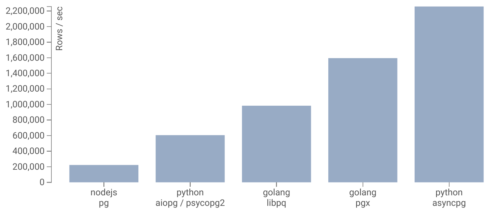

# NFP (NextJS + FastAPI + PostgreSQL) FullStack Project
## NFP Project Backend: FastAPI 영역
- - - -

#
#

### 주요 특징

* Database: Asyncpg 사용
-> 선정 이유: db 성능의 극대화
#
Link: https://github.com/MagicStack/asyncpg

#
#
* logger는 “rich” 라이브러리로 설계
